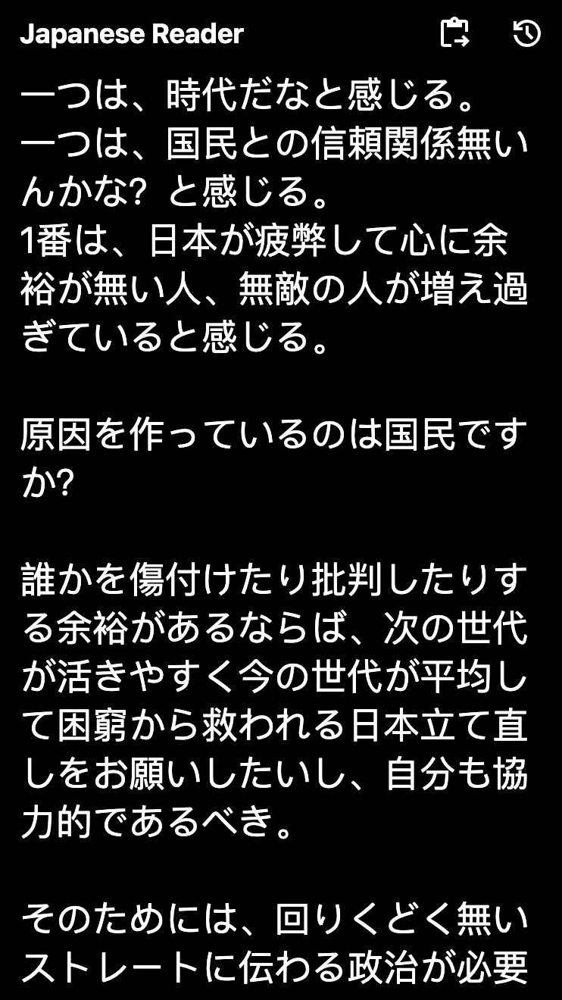
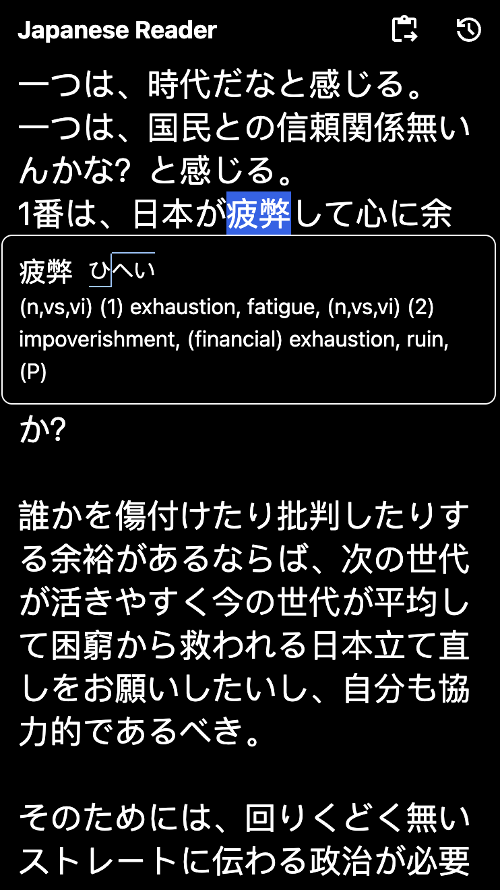
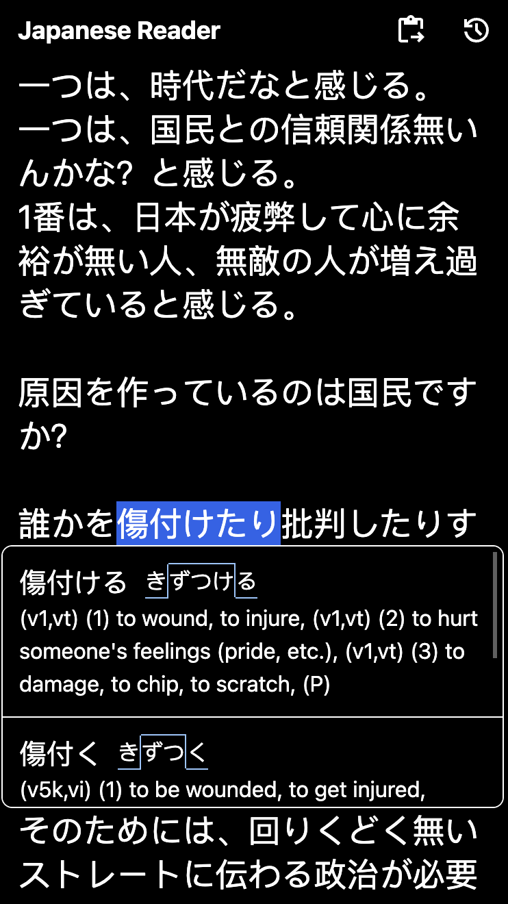
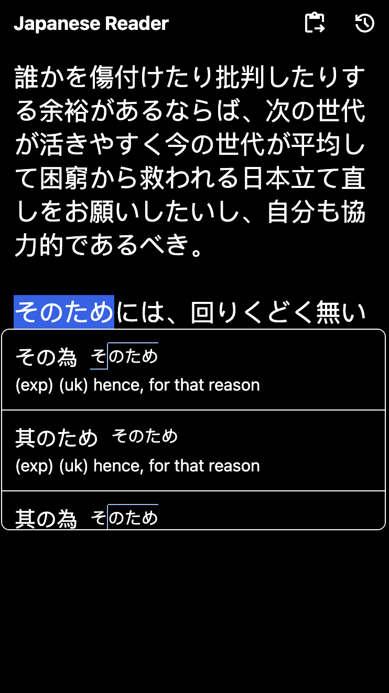
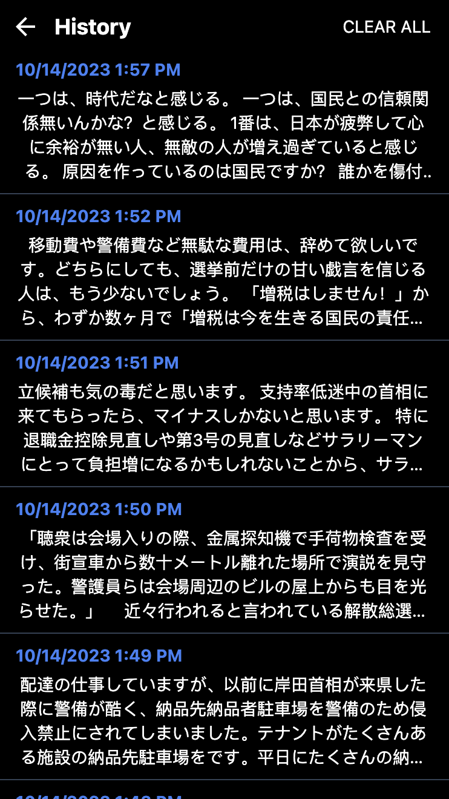
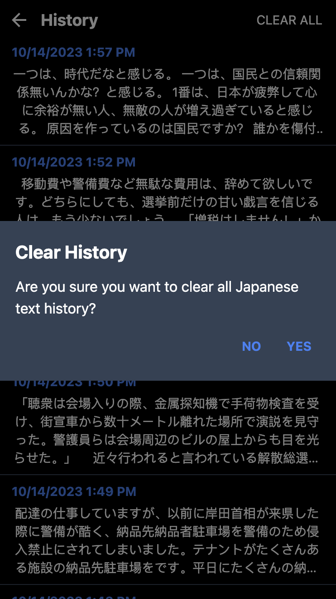
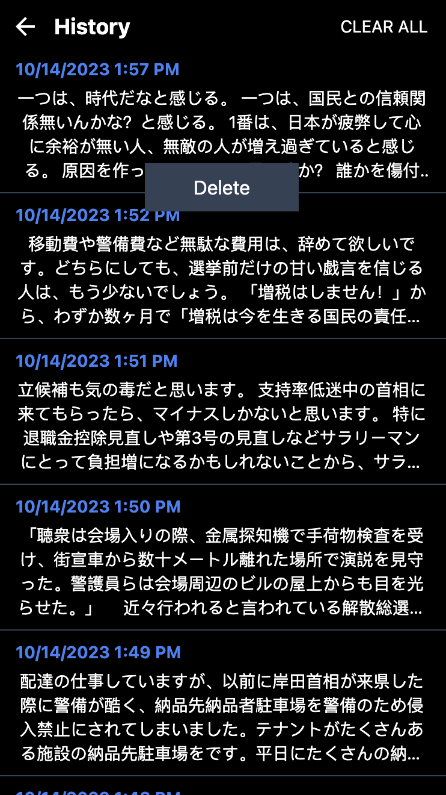

# Japanese Reader

A mobile-focused offline-mode Japanese reader web app.

Built with [React](https://react.dev), [TypeScript](https://typescriptlang.org), [Next.js](https://nextjs.org), [TailwindCSS](https://tailwindcss.com), and [Zustand](https://github.com/pmndrs/zustand). Initialized with [create-t3-app](https://create.t3.gg).

## Features

- Paste text from clipboard
- Look up Japanese words with pitch accent, conjugation, and multiple readings
- Save and view text history
- Clear all text history
- Delete individual text history entries (long-press history entry on mobile, right-click history entry on desktop)
- Installable progressive web app that works entirely offline

## Screenshots

  
  
  
  
  
  
  
  

## Credits

- [Pleco](https://pleco.com) for design inspiration
- [JMdict/EDICT](https://www.edrdg.org/wiki/index.php/JMdict-EDICT_Dictionary_Project) for the word dictionary
- [Rikaikun](https://github.com/melink14/rikaikun) for the formatted word dictionary, word dictionary index, verb deconjugation code, and other pieces of code
- [Kanjium](https://github.com/mifunetoshiro/kanjium) for the pitch accent dictionary
